# Help Window Architecture

This document describes the design and implementation of the Help Menu and child Help Window in Trama.

## Design Decisions (ADR 0005)

Trama loads user-facing help resources from static local HTML files within a child `BrowserWindow` via `loadFile()`.
This architecture ensures:
1. **Offline first support**: Help files are bundled with the app installer.
2. **Minimal workspace styling impact**: Help layout and styling are decoupled from main application editor styles.
3. **No network dependency**: The app does not query external servers.

## Workflow and IPC Communication

```mermaid
sequenceDiagram
    participant MainRenderer as Main Window (Renderer)
    participant ElectronMain as Electron (Main Process)
    participant HelpWindow as Help Window (Renderer)

    alt Help Menu Click or Hook Auto-Open
        MainRenderer->>ElectronMain: openHelp({ page })
    else Alt application menu click
        ElectronMain->>ElectronMain: Reads theme from Main Window
    end
    ElectronMain->>ElectronMain: Focuses or creates HelpWindow
    ElectronMain->>HelpWindow: loads file help/en/{page}.html
    HelpWindow->>ElectronMain: did-finish-load
    ElectronMain->>HelpWindow: inject theme (data-theme, colorScheme)

    rect rgb(30, 30, 40)
        Note over HelpWindow,MainRenderer: Getting Started Dismissal
        HelpWindow->>HelpWindow: User checks "Don't show again"
        HelpWindow->>ElectronMain: dismissGettingStarted()
        ElectronMain->>MainRenderer: executeJavaScript(localStorage.setItem('trama.help.getting-started.dismissed.v1', 'true'))
    end
```

## Files & Roles

- **`electron/main-process/help-window.ts`**: Manages the singleton `BrowserWindow` lifecycle, theme injection on load, and page changes.
- **`electron/help-preload.cts`**: Preload script for context-isolated Help Window exposing ONLY the `dismissGettingStarted` bridge.
- **`electron/ipc/handlers/help-handlers.ts`**: Registers `trama:help:open` and `trama:help:dismiss-getting-started` handlers.
- **`help/en/*.html`**: Tier 1 (Getting Started, About) and Tier 2 (advanced features) content pages.
- **`help/shared/`**: CSS stylesheet (`help.css`), theme controller (`help-theme.js`), and navigation bar logic (`help-nav.js`).
- **`src/features/project-editor/help-preferences.ts`**: Preference loader for checking and writing dismissal status on the main renderer.
- **`src/features/project-editor/use-auto-open-getting-started-effect.ts`**: Effect hook registered in `use-project-editor.ts` to trigger opening the window once per session on first project load.
