# Help Window Architecture

This document describes the design and implementation of the Help Menu and child Help Window in Trama.

## Design Decisions (ADR 0005)

Trama loads user-facing help resources from static local HTML files within a child `BrowserWindow` via `loadFile()`.
This architecture ensures:
1. **Offline first support**: Help files are bundled with the app installer.
2. **Minimal workspace styling impact**: Help layout and styling are decoupled from main application editor styles.
3. **No network dependency**: The app does not query external servers.

## Workflow and IPC Communication

```mermaid
sequenceDiagram
    participant MainRenderer as Main Window (Renderer)
    participant ElectronMain as Electron (Main Process)
    participant HelpWindow as Help Window (Renderer)

    alt Help Menu Click or Hook Auto-Open
        MainRenderer->>ElectronMain: openHelp({ page })
    else Alt application menu click
        ElectronMain->>ElectronMain: Reads theme from Main Window
    end
    ElectronMain->>ElectronMain: Focuses or creates HelpWindow
    ElectronMain->>HelpWindow: loads file help/en/{page}.html
    HelpWindow->>ElectronMain: did-finish-load
    ElectronMain->>HelpWindow: inject theme (data-theme, colorScheme)

    rect rgb(30, 30, 40)
        Note over HelpWindow,MainRenderer: Getting Started Dismissal Sync
        HelpWindow->>ElectronMain: getGettingStartedDismissed()
        ElectronMain->>MainRenderer: executeJavaScript(localStorage.getItem(KEY))
        MainRenderer-->>ElectronMain: 'true' | 'false' | null
        ElectronMain-->>HelpWindow: { dismissed: boolean }
        HelpWindow->>HelpWindow: checkbox.checked = dismissed
        HelpWindow->>ElectronMain: setGettingStartedDismissed(dismissed)
        ElectronMain->>MainRenderer: executeJavaScript(setItem|removeItem(KEY, 'true'))
    end
```

## Why the dismissal state lives in the main window

`useAutoOpenGettingStartedEffect` runs in the main renderer and decides whether to auto-open the help window on project open. For the checkbox in `help/en/getting-started.html` to read the same value, the help window must bridge the **main window's** `localStorage` — not its own — because the two `BrowserWindow`s have isolated storage areas.

The bridge is one IPC pair plus a small inline script run against the main window's `webContents`:

| Channel | Direction | Payload | Main-process action | Help preload method |
|---------|-----------|---------|---------------------|---------------------|
| `trama:help:get-getting-started-dismissed` | Help → Main | none | `mainWin.webContents.executeJavaScript(\`localStorage.getItem("${KEY}")\`)` returns `'true' \| 'false' \| null`; `=== 'true'` → `dismissed` | `getGettingStartedDismissed(): Promise<boolean>` |
| `trama:help:set-getting-started-dismissed` | Help → Main | `{ dismissed: boolean }` | `dismissed === true` → `setItem(KEY, 'true')`; else `removeItem(KEY)` | `setGettingStartedDismissed(dismissed: boolean): Promise<void>` |

The shared constant `GETTING_STARTED_DISMISSED_STORAGE_KEY` lives in `src/shared/help-storage-key.ts` so the main-process handler, the renderer-side `isGettingStartedDismissed()` helper, and the help page all reference the same key.

The HTML checkbox state lifecycle is symmetric:

1. On `DOMContentLoaded`, the help page calls `getGettingStartedDismissed()` and sets `checkbox.checked = Boolean(dismissed)`.
2. On every `change` event, the page calls `setGettingStartedDismissed(checkbox.checked)`. Check → write `'true'`. Uncheck → `removeItem` so the key is absent and `isGettingStartedDismissed()` returns `false` again.

## Files & Roles

- **`electron/main-process/help-window.ts`**: Manages the singleton `BrowserWindow` lifecycle, theme injection on load, and page changes.
- **`electron/help-preload.cts`**: Preload script for context-isolated Help Window exposing ONLY the `getGettingStartedDismissed` / `setGettingStartedDismissed` bridge. Unwraps IPC envelopes via `src/shared/help-getting-started-ipc-bridge.ts` before returning plain booleans to inline HTML scripts. Uses `sandbox: false` (same as the main window) because sandboxed preloads cannot `require` local helper modules.
- **`electron/ipc/handlers/help-handlers.ts`**: Registers `trama:help:open`, `trama:help:get-getting-started-dismissed`, and `trama:help:set-getting-started-dismissed` handlers. All storage access runs through `mainWin.webContents.executeJavaScript` against the **main** window.
- **`help/en/*.html`**: Tier 1 (Getting Started, About) and Tier 2 (advanced features) content pages. `getting-started.html` owns the dismissal checkbox.
- **`help/shared/`**: CSS stylesheet (`help.css`), theme controller (`help-theme.js`), and navigation bar logic (`help-nav.js`).
- **`src/shared/help-storage-key.ts`**: Single source of truth for `GETTING_STARTED_DISMISSED_STORAGE_KEY`; imported by the handler, the renderer-side helper, and (via re-export) by tests.
- **`src/features/project-editor/help-preferences.ts`**: Renderer preference loader for `isGettingStartedDismissed()` (DOM-aware wrapper over the shared key) and the pure `readGettingStartedDismissed(raw)` parser.
- **`src/features/project-editor/use-auto-open-getting-started-effect.ts`**: Effect hook registered in `use-project-editor.ts` to trigger opening the window once per session on first project load.

## Invariants

- The help window and the main window have **isolated** `localStorage` storage areas. Any persistent preference read or written from a help page must cross the main-process bridge above.
- The `dismissed` flag has only two effective states: `localStorage[KEY] === 'true'` or the key is absent. The renderer parser `readGettingStartedDismissed` treats `'true'` as `true` and any other value (including `'false'` or `null`) as `false`. The handler therefore uses `removeItem` rather than `setItem(KEY, 'false')` to keep the storage area minimal.
- The handler always targets the **main** window's `webContents`, never the help window's. The help window is the source of the user intent; the main window is the source of truth.
